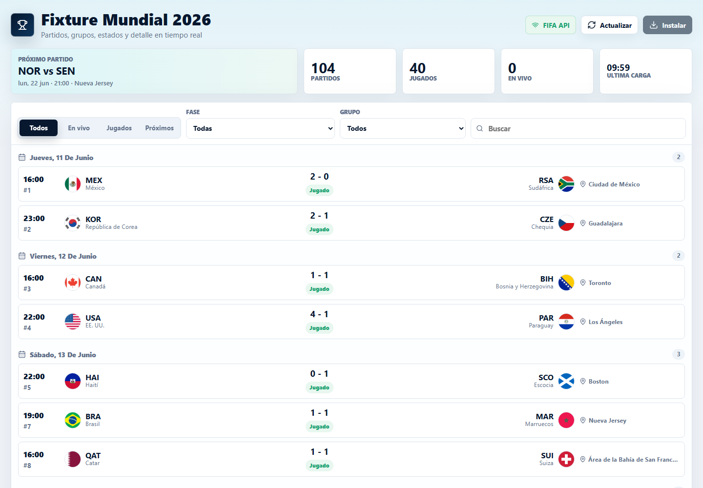
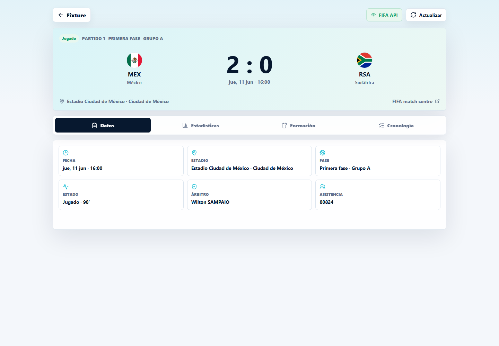
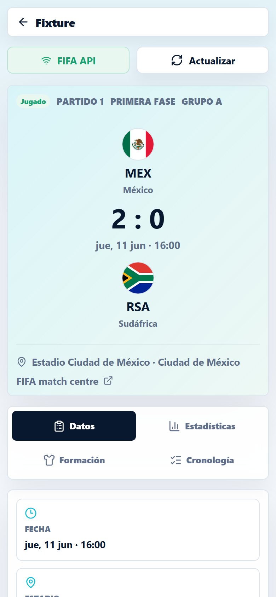

# Fixtu26

Fixtu26 is a progressive web app for following the FIFA World Cup 2026 fixture with live data from FIFA endpoints.

Live app: https://fixtu26.netlify.app

## Screenshots

### Fixture dashboard



### Match detail



### Mobile match detail



## Features

- Full World Cup 2026 match calendar.
- Live, played and upcoming match filters.
- Search by team, stadium, city, phase or group.
- Dedicated match screen with facts, derived stats, formations when available and timeline events.
- Offline-friendly PWA behavior using a seeded fixture snapshot and a service worker.
- Netlify-ready Vite build.

## Stack

- React 19
- Vite
- Lucide React icons
- Netlify static deploy

## FIFA API Endpoints

The app reads public FIFA API data:

- Fixture: `https://api.fifa.com/api/v3/calendar/matches?language=es&count=500&idSeason=285023`
- Match details: `https://api.fifa.com/api/v3/live/football/{matchId}?language=es`
- Timeline: `https://api.fifa.com/api/v3/timelines/{matchId}?language=es`

The API exploration notes are documented in [docs/fifa_api_2026.md](docs/fifa_api_2026.md).

## Run Locally

```bash
cd pwa
npm install
npm run dev
```

## Build

```bash
cd pwa
npm run build
```

The production build is generated in `pwa/dist`.

## Deploy

The included Netlify config builds the PWA from the `pwa` folder:

```bash
cd pwa
npx netlify deploy --prod --dir=dist
```

## Project Structure

```text
.
├── docs/
│   └── fifa_api_2026.md
└── pwa/
    ├── public/
    ├── src/
    ├── netlify.toml
    └── package.json
```
